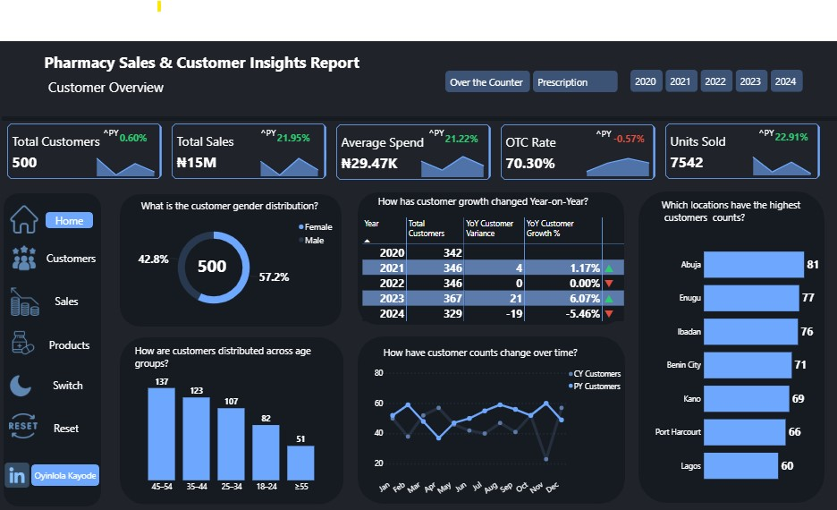
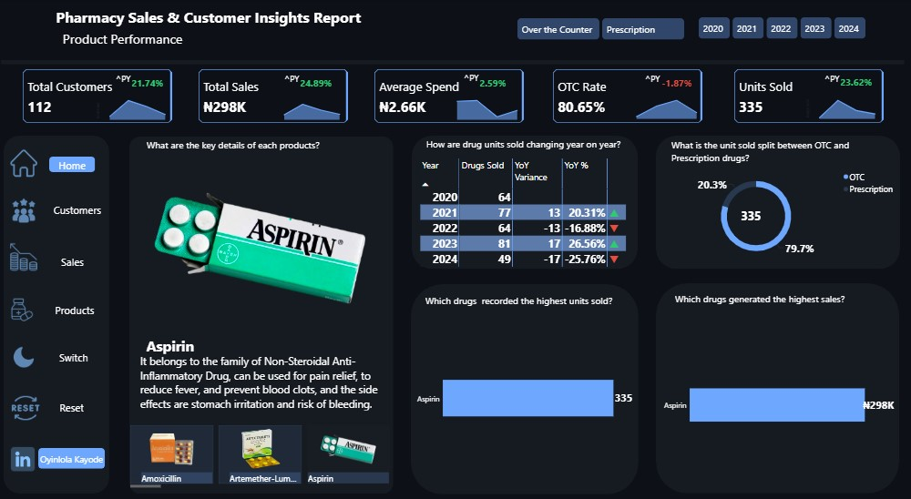
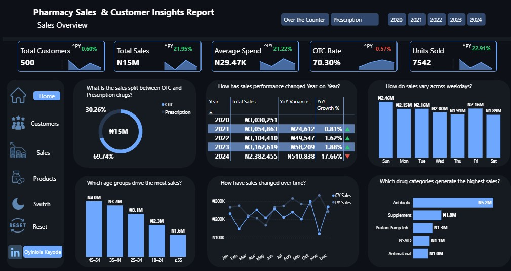

# Pharmacy Sales and Customer Insights Report

---

## 📑 Table of Contents
1. Overview
2. Rationale for the Project
3. Objectives
4. Data Description
5. Tech Stack
6. Project Scope
7. Methodology
8. Project Visualization
9. Results (Key Findings)
10. Actionable Recommendations
11. Future Work
12. Conclusion

---

## 1. Overview
This report presents a comprehensive descriptive analysis of pharmacy operations, focusing on sales performance, customer behavior, and product dynamics.  
The analysis integrates multiple data sources, including pharmacy transactions, customer demographics, and product catalog details, with a special emphasis on **Over-The-Counter (OTC) vs Prescription drugs**.  

Using interactive dashboards, KPIs, and advanced visualization techniques, this study identifies key business insights, trends, and patterns to drive operational and strategic decisions.

---

## 2. Rationale for the Project
Increasing self-medication and OTC consumption is reshaping pharmacy dynamics.  
Stakeholders need clear insights into which products generate revenue, how customers behave, and how OTC adoption compares to prescription purchases.  
This project aims to provide a **data-driven understanding of market trends**, highlight opportunities for growth, identify potential risks, and guide strategic interventions.

---

## 3. Objectives
- Track year-on-year sales and unit performance, highlighting declines or growth periods
- Assess OTC vs Prescription trends and customer adoption rates
- Identify top-selling products and high-revenue drug categories
- Understand customer demographics, including age, gender, and location
- Provide actionable insights for inventory, marketing, and operational improvements
- Showcase professional analytical capabilities via interactive dashboards and advanced modeling

---

## 4. Data Description
The project used three primary tables:

**Pharmacy Drugs Table**  
- Columns: Drug ID, Name, Family/Category, Description, Image URL  
- Purpose: Provide product metadata and visualization content

**Pharmacy Customers Table**  
- Columns: Customer ID, Age, Gender, Location, Age Group  
- Purpose: Track customer demographics and enable segmentation

**Pharmacy Transactions Table (Fact Table)**  
- Columns: Transaction ID, Customer ID, Drug ID, Purchase Date, Quantity, Price per Unit, Total Price, Purchase Type (OTC/Prescription)  
- Purpose: Core transactional data for calculating KPIs, trends, and analysis metrics

All tables were modeled in **Power BI using a star schema**, ensuring relationships between customers, products, and transactions are efficient and support advanced analytics.

---

## 5. Tech Stack
- **Power BI**: Interactive dashboards, visuals, slicers, and KPI cards  
- **DAX**: Measures for Year-on-Year growth, variance, OTC rates, and other advanced calculations  
- **Excel**: Initial dataset creation, cleaning, and age grouping  
- **IMGUR & Image URLs**: Hosted product images for visual representation in dashboards  
- **Data Modeling**: Star schema to relate fact and dimension tables for accurate aggregation  

---

## 6. Project Scope
The scope covers three dashboards:

**Sales Dashboard**: Revenue, KPIs, day-of-week trends, age group revenue, and category performance  
**Customer Dashboard**: Customer demographics, YoY growth, location, gender, and age segmentation  
**Product Dashboard**: Drug units sold, top-selling products, OTC vs Prescription split, product images, descriptions, and YoY trends  

Analysis includes year-on-year comparison, unit sales trends, customer segmentation, and category concentration risks.

---

## 7. Methodology
- **Data Cleaning & Validation**: Verified product IDs, transaction totals, and customer demographics  
- **Age Grouping**: Categorized customers into 18–24, 25–34, 35–44, 45–54, and ≥55  
- **Measures & KPIs**: Created in Power BI: Total Sales, Average Spend, OTC Rate, Units Sold, YoY Growth/Variance  
- **Dashboards**: Used cards, bar charts, pie charts, tables, and image cards for intuitive visualization  
- **Cross-filtering & Interaction**: Slicers allow dynamic filtering by product, age, location, or time period  
- **Descriptive Analytics**: Focused on explaining what happened and why trends occurred, linking KPIs to visual insights  

---

## 8. Project Visualization

**Sales Dashboard**  
- Top KPI cards: Total Customers, Total Sales, Average Spend, OTC Rate, Units Sold  
- Pie chart: OTC vs Prescription split  
- Table: Year-on-Year Sales with variance and growth  
- Bar chart: Day-of-week sales trends  
- Bar chart: Revenue by age group  
- Bar chart: Category sales distribution  

**Customer Dashboard**  
- KPI cards: Total Customers, Total Sales, Average Spend  
- Donut chart: Gender distribution  
- Table: YoY customer growth  
- Bar chart: Customer counts by age and location  
- Line chart: Monthly customer trends  

**Product Dashboard**  
- Bar chart: Top 10 drugs by sales  
- Bar chart: Top 10 drugs by units sold  
- Table: YoY units sold, variance, and growth  
- Donut chart: OTC vs Prescription units sold  
- Card visuals: Product images, names, and descriptions  

---

## 9. Results (Key Findings)

**Sales Insights**  
- Total Revenue: ₦14.73M; positive YoY, except a 17.66% drop in 2024  
- OTC Dominance: 70.3% of sales; prescription sales represent 30.3%  
- Day-of-Week Patterns: Sundays highest sales; Thursday/Saturday lowest  
- Age Cohorts: 45–54 drives most revenue; 35–54 cohort is primary focus  
- Category Concentration: Antibiotics dominate (~₦5.2M), followed by supplements and NSAIDs  

**Customer Insights**  
- Total Customers: 500; YoY decline in 2024 to 329  
- Gender Split: Male 57.2%, Female 42.8%  
- Age Distribution: Highest customers in 45–54 and 35–44 age groups  
- Location: Highest counts in Abuja (81), Enugu (77); Lagos lower than expected (60)  

**Product Insights**  
- Top Drug: Amoxicillin dominates units (367) and sales (₦1.46M)  
- YoY Unit Trends: Peak in 2022, decline in 2023/2024 (−36.92% in 2024)  
- OTC vs Prescription: Units roughly 70:30; mirrors revenue trends  
- Single Product Risk: Heavy reliance on one SKU is a business vulnerability  

         

## 10. Actionable Recommendations

**Investigate 2024 Decline**  
- Audit transaction completeness for 2024; verify invoice cutoffs and stock availability  
- Identify root causes (stockouts, supplier delays, pricing, or customer churn)  

**Diversify Product Mix**  
- Reduce dependency on Amoxicillin and antibiotics  
- Promote supplements, chronic care products, and GI/NSAIDs  

**Target High-Value Customers**  
- Focus campaigns and loyalty programs on 35–54 age group  
- Bundle chronic-care and OTC products for cross-sell opportunities  

**Leverage Peaks**  
- Plan staffing and inventory for Sundays and year-end spikes  
- Schedule promotions for low-traffic days (Thu/Sat) to improve conversion  

**Optimize OTC vs Prescription Mix**  
- Explore prescription adoption for higher margins  
- Implement compliance tracking and stewardship programs  

**Geo-Target Marketing**  
- Expand presence and campaigns in underperforming areas (e.g., Lagos)  
- Focus on cities with highest customers (Abuja, Enugu, Ibadan) for upsell/cross-sell  

---

## 11. Future Work
- Automate dashboard updates for real-time insights  
- Expand product catalog to include more categories for diversification  
- Integrate predictive models for sales forecasting and customer churn  
- Add margin/profit analysis for ROI-driven decision-making  
- Include basket analysis to understand multi-product purchase patterns  

---

## 12. Conclusion
This analysis provides a complete picture of pharmacy performance, highlighting OTC dominance, customer segments, and top-performing drugs.  
Insights are actionable and tied directly to business metrics, showing where the company can improve retention, diversify products, and optimize operations.  
The report and dashboards showcase professional analytical expertise, data modeling skills, and visualization capabilities, serving as a reliable guide for strategic decisions.
